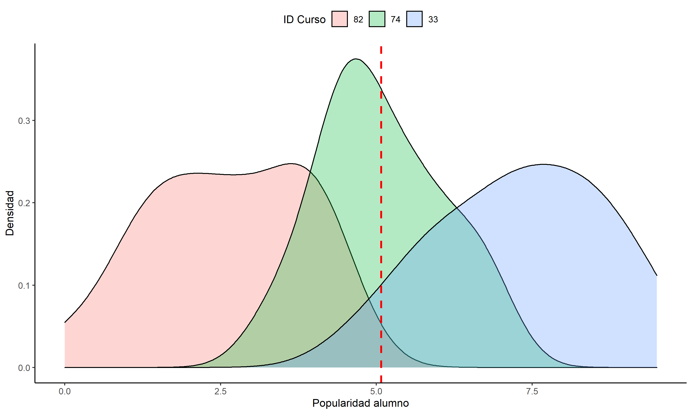

# Setup 

En el caso de paper.Rmd, debemos usar:

```{r}
knitr::opts_knit$set(base.url = "../") #relative path for .html output file
# knitr::opts_knit$set(root.dir = "../") #relative path for chunks within .rmd files
```


Principalmente porque necesitamos que al crear el html, la ruta tenga un "../" al principio para que capture las imágenes guardadas en la carpeta output/images. Lo mismo para usar los RData de las tables.


Esta es una imagen creada en analysis.Rmd, y que luego guardamos en `output/images`
```{r,out.width='75%',fig.cap='La distribución según escuelas'}
 
```


# Introduction


# Methods

# Discussion


<embed src="../paper.pdf" type="application/pdf" width="100%" height="600px" />


