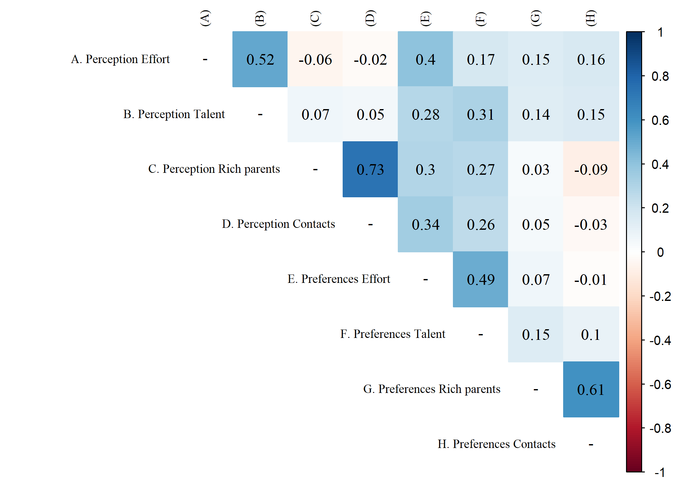

# Introduction

# Methods

# Discussion


* Siempre hay que usar "../" ya que al compilar el sitio, en la carpeta "public", se crea una carpeta "paper" al mismo nivel que la carpeta "output".


```{r}
 
```


